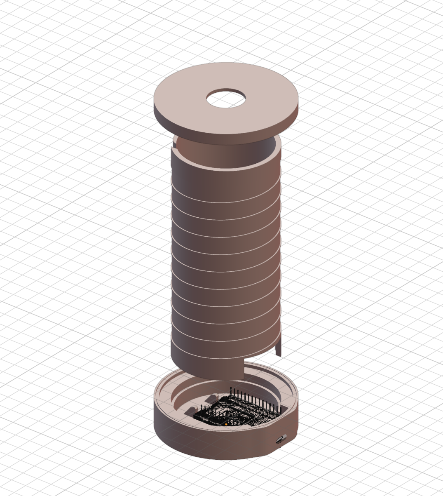

# Desklamp
A desk lamp that is based on an ESP32 and uses an LED strip as a light source

This repository documents the development and control of a desk and ambient lamp. The lamp combines functional lighting for the work area with atmospheric light modes for a pleasant room ambience.

## Components  

### Hardware Used  
| Name | Description | Image |
|-----------------------|--------------------------------------------------------------------------------------------------------|-----------------------------------------------|  
| **RGBW LED Strip** | An RGBW LED strip providing vibrant colors and adjustable white tones.[AliExpress](https://de.aliexpress.com/item/1005007011130121.html) |  |  
| **ESP32** | Seeed Studio XIAO ESP32S3 for controlling the lamp and enabling smart features.[AliExpress](https://de.aliexpress.com/item/1005006336964908.html) |  |  
| **Push Button Switch** | An Button to turn the lamp on/off and to switch mode[AliExpress](https://www.aliexpress.com/item/1005004920346156.html) |  |

### Libraries Used  
- **Arduino.h**: for millis() and random().
- **math.h**: for sin() and PI.
- **driver/rmt.h**

## Assembly Instructions  

### Wiring Diagram  
  

### 3D-Printed Case
- **Download the 3D model here:** [3D model file](3dmodel)
- **Preview:**  

## Installation Instructions  

1. **Setup Arduino IDE**:  
   - Install the [Arduino IDE](https://www.arduino.cc/en/software).

2. **Download the Code**:  
   - Download the code from the src folder 

3. **Flash Firmware**:  
   - Upload the code onto your ESP32 using the Arduino IDE or PlatformIO.  

4. **Assemble the Lamp**:  
   - Connect all components as described in the wiring diagram and place them in the 3D-printed case.  

## License  
This project is licensed under the [Creative Commons Attribution-NonCommercial 4.0 International License](https://creativecommons.org/licenses/by-nc/4.0/). You may share and adapt this material for non-commercial purposes with appropriate attribution.  

---  

Author: [Instagram](https://www.instagram.com/j.kob.h/) | [YouTube](https://www.youtube.com/@jkobh)